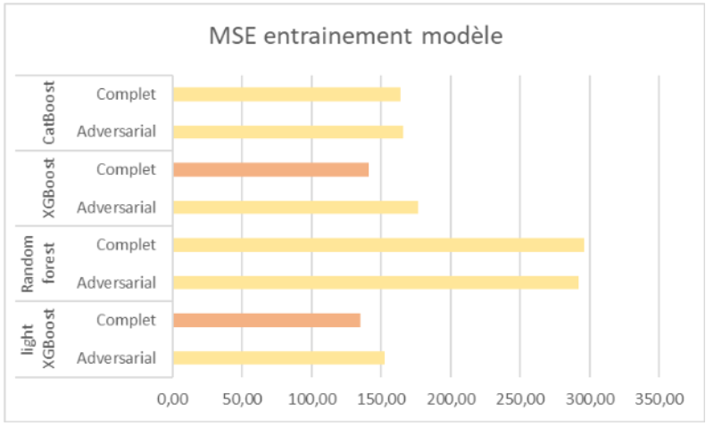
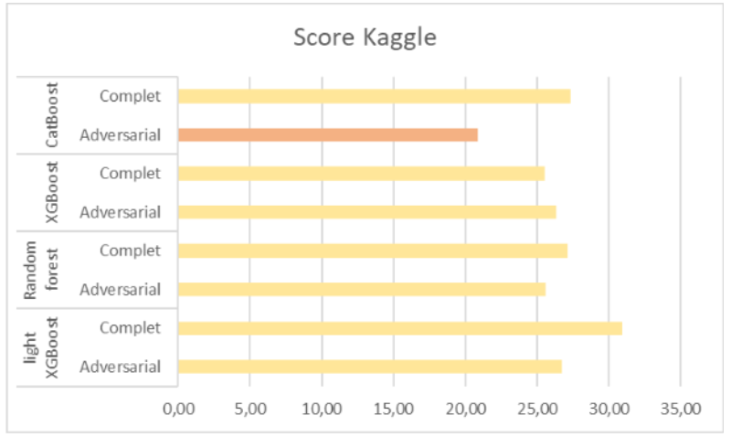

# Defi-IA-bedbugs

Vous trouverez la première version du git où nous avons travaillé durant ce semestre ici : ``https://github.com/leacamusat/Defi-IA-bedbugs``. Ce git présente les différents élements de rendu que vous avez demandés. 

## Structure de nos fichiers

**Defi-IA-bedbugs / 
&emsp; &emsp;├─data (jeux de données) 
&emsp; &emsp; &emsp; &emsp;├─ all_our_requests_done.csv 
&emsp; &emsp;&emsp; &emsp; ├─ features_hotels.csv 
&emsp; &emsp; &emsp; &emsp;├─ pricing_requests_done.csv 
&emsp; &emsp;&emsp; &emsp; ├─ soumission.csv 
&emsp; &emsp;&emsp; &emsp; ├─ test_set_cleaned_addedFeatures.csv 
&emsp;&emsp; &emsp;&emsp; &emsp; ├─ test_set.csv 
&emsp; &emsp;├─dictionnary(poids pour le target et frequency encoding) 
&emsp; &emsp;&emsp; &emsp; ├─ children_policy 
&emsp; &emsp;&emsp; &emsp; ├─ mobile 
&emsp; &emsp;&emsp; &emsp; ├─ parking 
&emsp; &emsp;&emsp; &emsp; ├─ pool 
&emsp; &emsp;&emsp; &emsp; ├─ target encoding 
&emsp; &emsp;├─ models (tous les poids des modèles sont enregistrés) 
&emsp; &emsp;&emsp; &emsp; ├─ __init__.py 
&emsp; &emsp;├─ notebook 
&emsp; &emsp;&emsp; &emsp; ├─ Analysis.ipynb 
&emsp; &emsp;├─ README.md 
&emsp; &emsp;├─ utilities(toutes les fonctions en .py 
&emsp; &emsp;&emsp; &emsp; ├─ adversarial_validation.py 
&emsp; &emsp;&emsp; &emsp; ├─ data_preprocessing.py 
&emsp; &emsp;&emsp; &emsp; ├─ Dockerfile 
&emsp; &emsp;&emsp; &emsp; ├─ flagged 
&emsp; &emsp;&emsp; &emsp; ├─ generation_submission.py 
&emsp; &emsp;&emsp; &emsp; ├─ gradio_defiIA.py 
&emsp; &emsp;&emsp; &emsp; ├─ models.py 
&emsp; &emsp;&emsp; &emsp; ├─ set_path.py**

## __Commandes à suivre pour faire fonctionner Defi-IA-bedbugs__

### Etapes à réaliser uniquement si vous utilisez Gcloud 
0) Avoir au préalable créé une machine virtuelle sur gcloud (instance de VM)
1) Aller sur gcloud: https://console.cloud.google.com/compute/instances
2) Activer votre instance gcloud
3) Dans SSH > afficher la commande gcloud puis copier la commande gcloud
4) Ouvrir un terminal de commande local sur votre machine
5) Coller la commande gloud préalablement copiée et la collée dans un terminal en local.
   Ceci ouvre un temrminal gcloud à distance, ce qui vous permettra de navigueur sur votre machine gcloud à distance.
6) Ouvrir le terminal gcloud à distance et suivre les instructions suivantes.

**Note:** Ne pas oublier de désactiver la machine virtuelle gcloud à la fin des manipulations.

 ### Etapes à réaliser dans tous les cas
 
1) Télécharger le git sur votre machine (sur instance de VM ou sur l'ordinateur personel): `git clone https://github.com/LilaR66/Defi-IA-bedbugs`
2) Se placer dans le dossier Defi-IA-bedbugs: `cd Defi-IA-bedbugs`
3) Faire un wget pour obtenir les poids d'un modèle déjà entraîné: 
   `wget "https://drive.google.com/uc?export=download&id=1PaO_wYNzTk518w8DC_2XDZdbWhEZQrim" -O ./models/modele_best.sav`  Il s'agit d'un modèle catboost
4) Créer une image docker nommée image1: `sudo docker build -t image1 ./utilities`
5) Créer un conteneur  docker nommé conteneur1 avec le volume du git mount à l'intérieur: `sudo docker run -it --name  container1 -v "$(pwd)":/mnt image1`
6) Vous devez vous trouver dans conteneur1. Placez-vous dans le bons dossier dans conteneur1: `cd mnt/utilities/`

7) Il y a à présent 2 possibilités: \
  &emsp;  **7.1)** Vous voulez entraîner votre modele puis lancer le gradio: \
  &emsp; &emsp;      a) pour obtenir l'aide pour les argument, appeler si besoin: `python3 models.py --help`  
  &emsp; &emsp;      b) appeler: `python3 models.py --train 1 --name 0 --dataset "pricing_requests_done.csv" --adversarial 0 --hotelid 1 --name_save "modele_run_docker.sav"` \
  &emsp; &emsp;      c) utiliser le modèle que vous venez d'apprendre pour lancer le gradio: `python3 gradio_defiIA.py --model_name "modele_run_docker.sav"` \
  &emsp; &emsp;      d) copier le lien public et l'ouvrir dans un navigateur \
  &emsp;  **7.2)** Vous voulez utiliser les poids d'un modèle déjà appris et lancer le gradio:\
  &emsp; &emsp;      a) utiliser le modèle déjà appris pour lancer le gradio: `python3 gradio_defiIA.py --model_name "modele_best.sav"`\
  &emsp; &emsp;      b) copier le lien public et l'ouvrir dans un navigateur\

 ### Etapes à réaliser à la fin des manipulations
1) supprimer le container: `sudo docker container rm -f container1` 
2) supprimer l'image : `sudo docker rmi image1 --force

## Résultats de nos modèles 

